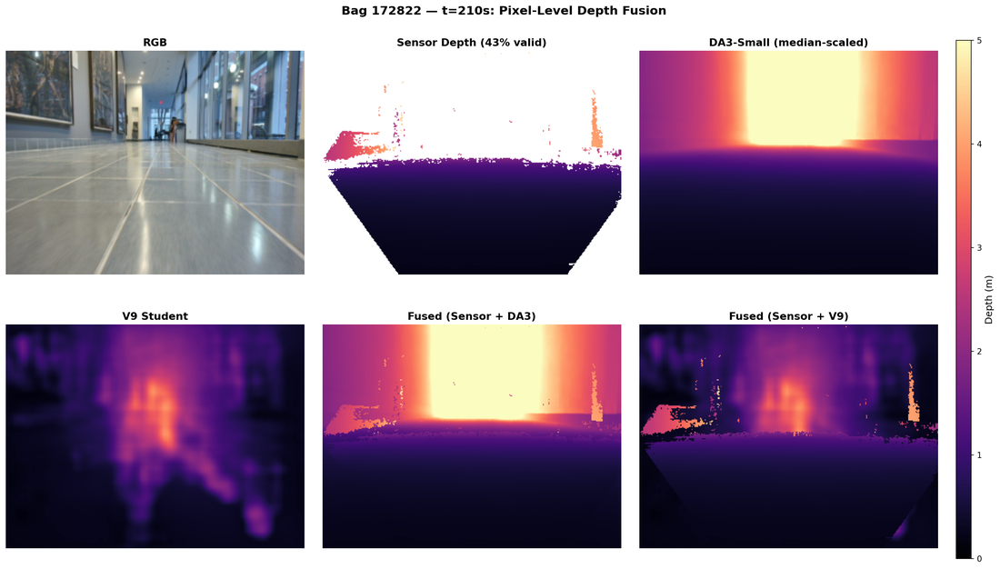
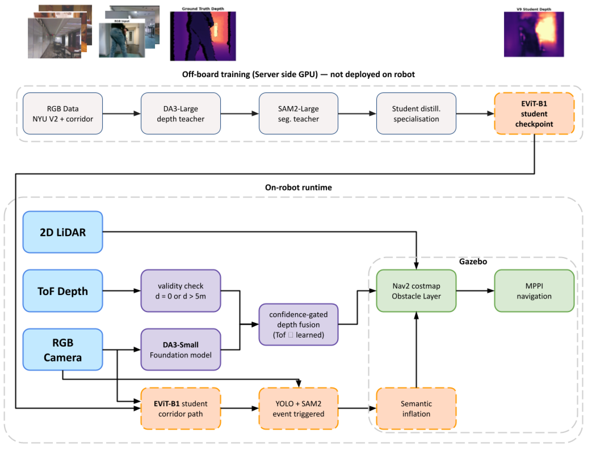
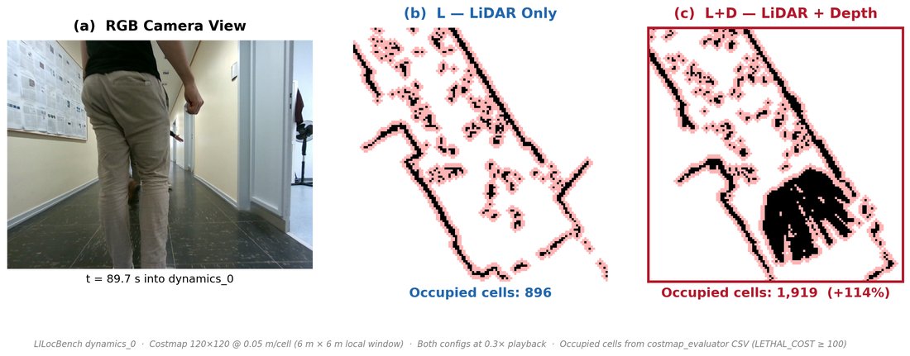
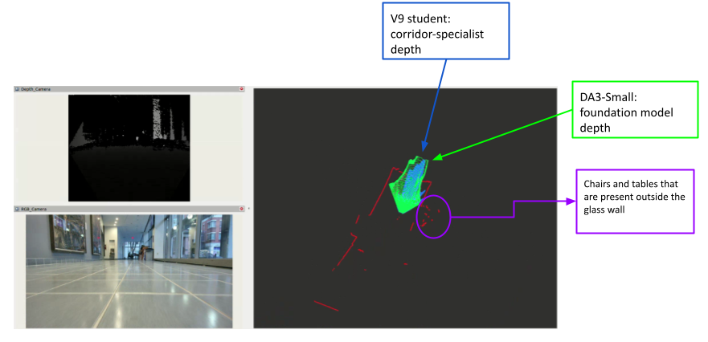
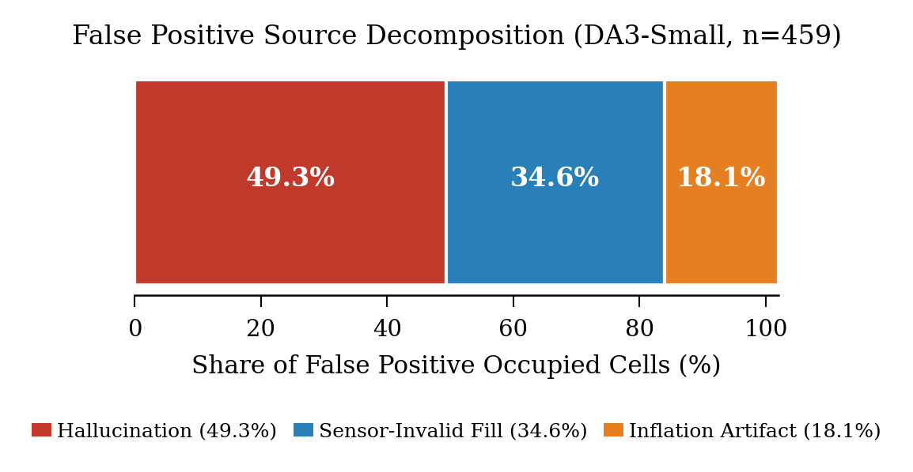

<div align="center">

# ml_inference

**Vortex training pipeline — knowledge distillation for monocular depth + 6-class semantic segmentation, designed for ROS 2 / Nav2 deployment on a Jetson Orin Nano.**

[](https://www.python.org/)
[](https://pytorch.org/)
[](https://onnx.ai/)
[](https://developer.nvidia.com/tensorrt)
[](LICENSE)
[](https://arxiv.org/abs/2603.28890)



*A typical corridor frame. The Femto Bolt ToF sensor (top-right) loses **77.8 %** of its pixels on the polished floor and glass surfaces. DA3-Small (zero-shot foundation model) and the V9 student (this repo) fill the dead pixels with consistent geometry; the runtime then prefers ToF where it survives and falls back to learned depth elsewhere.*

</div>

---

## What this is

A reproducible training scaffold that produces small, quantization-friendly student models for indoor depth + segmentation, distilled from large foundation teachers. We use it to study a single question:

> Can a single RGB camera running a foundation monocular depth model stand in for, or augment, the structured-light/ToF sensors that dominate today's indoor navigation stacks?

The answer the paper defends, in one sentence: **monocular depth cannot replace LiDAR outright, but it is an unexpectedly strong fusion partner** — fusing LiDAR with depth recovers ~+55 % occupied costmap cells in narrow corridors and fills dense depth exactly where the hardware sensor gives up.

This repository is the **off-board** half of that story:

| Lives here (`ml_inference`) | Lives elsewhere (sibling repo `NCHSB`) |
|---|---|
| Teacher inference on HPC (DA3-Metric-Large + YOLO + SAM2-Large) | ROS 2 nodes (Depth Fusion, Class Costmap, Student TRT, YOLO TRT) |
| Student training (V1 → V9 lineage) | `nav2_params_rc.yaml`, controllers.yaml, EKF, launch files |
| ONNX / TensorRT export and Jetson micro-benchmarks | Live Nav2 integration on the Traxxas Maxx 4S testbed |
| Offline evaluation scripts that produce the paper's tables | The Gazebo simulation worlds and the rosbag harness |

If you want the runtime, look at `NCHSB`. If you want to retrain the student on your own corridor data, you are in the right place.

---

## Highlights

- **Bootstrap perception, not blind replacement.** The motivating statistic — `pixel_fusion.json:319-322` — is that the Orbbec Femto Bolt ToF returns valid depth on only **22.21 %** of pixels in our corridor. The other 77.79 % are reflective floor, glass, and out-of-range walls. A monocular student trained the right way fills the gap *predictably*.
- **V9 student: 0.382 m RMSE on LILocBench** (V6 → LILocBench fine-tune), **9 / 10** Gazebo closed-loop success — matches the GT-depth reference run on the same seeds.
- **DA3-Small foundation, zero-shot:** **218 FPS / 4.6 ms / 2.7 GB** on Jetson Orin Nano (TensorRT FP16, 308 × 308). Used as the production runtime; the V-series students here are the corridor-specialised companions.
- **Faithful runtime ↔ training mirror.** The hybrid-depth supervision target (`models/losses.py:26-60`) is *the same equation* as the runtime confidence-gated fusion (`Depth Fusion Node` in NCHSB) — `target = ToF if confidence ≥ τ else DA3`. Train target and deployment fusion encode the same prior.
- **Honest, audited results.** Every number in the table below traces to a JSON file under `results/`. The dropped APE/SLAM claim is documented in [§ Honest caveats](#honest-caveats).

---

## Architecture



Two halves of one system. The dashed boundary is where this repo ends and `NCHSB` begins.

**Off-board (this repo, on NYU HPC):**
1. `teacher_infer/run_da3.py` produces metric-depth supervision per frame from DA3-Metric-Large (`metric = focal · raw / 300`).
2. `teacher_infer/run_sam2.py` produces 6-class segmentation labels by combining YOLOv8 detections (person, furniture), SAM2-Large mask refinement, and geometric heuristics for floor / wall / glass.
3. `teacher_infer/build_manifest.py` emits a `manifest.jsonl` linking every RGB to its DA3 depth, SAM2 seg, ToF depth, and ToF confidence.
4. `train.py` trains an EfficientViT-B1 student (5.31 M params) with a hybrid depth loss + cross-entropy seg + edge-aware smoothness, optionally Kendall-uncertainty-weighted.
5. `export_trt.py` exports ONNX → TensorRT FP16 / INT8 engines for the Jetson.

**On-board (NCHSB, on the Jetson):** Student TRT Node consumes RGB and publishes `/student/depth` + `/student/segmentation`. Depth Fusion Node combines the student output with the surviving ToF pixels and publishes `/perception/fused_depth`. Point Cloud XYZ Node back-projects that into `/perception/fused_depth_points`, which Nav2's local costmap consumes.

---

## The student lineage (V1 → V9)

The repository's `main` reflects the V4-V9 production codebase. The earlier V1-V3 baseline (MobileNetV3-Small + DA2-Large) is preserved verbatim under [`archive/v1-v3-baseline/`](archive/v1-v3-baseline/) and reproducible exactly via the `v1-v3-baseline` git tag.

Corridor RMSE is reported on two different sets: **LILocBench** (Bonn corridor benchmark, used for fine-tuning V7 and V9) and **Femto Bolt** (our own indoor corridor recordings, used as the deployment-truth set). They are not interchangeable — LILocBench is shorter and structurally simpler.

| Version | Backbone | Teacher | NYU RMSE | LILocBench RMSE | Femto Bolt RMSE | What changed | Why it matters |
|---|---|---|---|---|---|---|---|
| V1 | MobileNetV3-Small | DA2-Large | 75.37 m | — | — | Initial training | Disaster: DA2 emits *relative* depth, no scale anchor. Lesson, not a result. |
| V2 | MobileNetV3-Small | DA2-Large | — | — | — | Kendall clamp experiments | Diagnostic only. |
| V3 | MobileNetV3-Small | DA3-Large | 1.160 m | — | — | berHu loss, Kendall weighting, two-LR optimizer | First version that deserves to be called real. |
| V4 | **EfficientViT-B1** | DA3-Large | 0.774 m | — | 1.373 m | Backbone swap | -33 % NYU RMSE; backbone still matters once the recipe is right. |
| V5 | EfficientViT-B1 | DA3-Large | **0.572 m** | — | 2.186 m | Deployment augmentations | **Best general indoor model.** Augmentations help NYU, hurt domain transfer. |
| V6 | EfficientViT-B1 | DA3-Large | **0.519 m** | — | 2.158 m | SUN+DIODE pretrain → NYU finetune | **Best NYU depth.** The right base for specialisation. |
| V7 | EfficientViT-B1 | DA3-Large | 1.315 m | 0.445 m | 1.982 m | V5 → LILocBench fine-tune | First serious corridor specialist. Catastrophic NYU forgetting. |
| V8 | EfficientViT-B1 | DA3-Large | 0.592 m | — | 2.266 m | Mixed NYU + LILocBench from V5 | Failed: mixing made corridor *worse* than V5. Domain gap not bridged by naive mixing. |
| **V9** | EfficientViT-B1 | DA3-Large | 1.553 m | **0.382 m** | 1.589 m | V6 → LILocBench fine-tune | **Best corridor specialist.** Used in paper Gazebo experiments. |

Recipe details and per-version provenance are in [`changelog.tex`](changelog.tex) (4 220 lines, versioned alongside the code) and the obsidian project vault (separate repo).

**When to use which checkpoint:**
- **V5** — best general-purpose indoor student (NYU 0.572 m, balanced).
- **V6** — best NYU depth (0.519 m), recommended pretraining base for further specialisation.
- **V9** — best corridor specialist on LILocBench (0.382 m), used in the paper's Gazebo closed-loop experiments. Pays for it with NYU forgetting (1.553 m).
- **DA3-Small (foundation)** — used as the production runtime model on the Jetson, zero-shot. The V-series students complement it; they don't replace it.

---

## Results

Numbers below are reproduced from the paper's `paper_stats.json` and the per-experiment JSON files in [`results/`](results/). Every row has an `n` and a 95 % CI in source; only the headline is shown here.

### DA3-Small zero-shot on NYU val (paper Table VII teacher row)

| Metric | Value | n |
|---|---|---|
| RMSE (m) | 0.513 ± 0.038 | 290 |
| AbsRel | 0.124 ± 0.008 | 290 |
| δ < 1.25 (%) | 85.2 ± 1.6 | 290 |
| δ < 1.25² (%) | 95.3 ± 0.7 | 290 |
| Latency (ms, PyTorch) | 65.3 | — |

Source: `results/nyu_da3_da3-small_val.json`. The 218 FPS / 4.6 ms / 2.7 GB headline is the same model under TensorRT FP16 at 308 × 308 on Jetson Orin Nano (separate Jetson benchmark; not from this PyTorch run).

### Pixel-level depth on the corridor (459 frames)

| Method | RMSE (overall) | RMSE (near 0-1.5 m) | RMSE (mid 1.5-3 m) | RMSE (far 3-6 m) | δ < 1.25 (%) |
|---|---|---|---|---|---|
| Sensor (ToF) | 0.000 | 0.000 | 0.000 | 0.000 | 100 |
| **DA3-Small** | **0.522** | 0.145 | 0.503 | 1.305 | 53.4 |
| V9 student | 1.418 | 1.642 | 1.461 | 1.012 | 17.2 |

Sensor RMSE is zero by construction — sensor pixels are the "ground truth" against which everything else is scored on the surviving 22.21 % valid mask. Source: `results/pixel_fusion.json`.

DA3-Small dominates V9 on this metric. V9 wins the *corridor specialist* benchmark on LILocBench (above) but is not the right pick for general per-pixel accuracy.

### Costmap recovery (paper Table III, n = 459 frames)

| Config | IoU | Detection rate (%) | FPR (%) | Inflation radius (m) | Timing (ms) |
|---|---|---|---|---|---|
| Baseline | 1.000 | 100.0 | 0.0 | 0.090 | 16.5 |
| A1 (depth only) | 1.000 | 100.0 | 0.0 | 0.177 | 63.3 |
| A3 (L+D, fixed inflation) | 0.379 | 100.0 | 5.2 | 0.177 | 133.8 |
| A4 (L+D, adaptive) | 0.279 | 76.7 | 5.2 | 0.165 | 132.6 |
| A5 (L+D, large inflation) | 0.379 | 100.0 | 5.2 | 0.192 | 206.2 |
| A6 (L+D, conservative) | 0.279 | 76.7 | 5.2 | 0.197 | 189.9 |

Source: `results/costmap_ablation/corridor/summary.json`. Headline elsewhere in the paper: **L → L+D adds +55 % occupied cells** in narrow corridors (2 295 → 3 546 mean occupied; `paper_stats.json:table_iv`).



LILocBench `dynamics_0`: 10 pedestrians moving through the scene. L+D recovers pedestrian bodies that L misses entirely.



Live Nav2 costmap during corridor replay. Green = pixels filled by DA3, blue = pixels filled by V9, white = surviving ToF.

---

## Honest caveats



The 5.2 % FPR in the L+D configuration is not free. Decomposition (`results/fpr_audit.json`):

- **49.3 %** are model hallucinations (depth model predicting a wall where none exists).
- **34.6 %** are sensor-invalid-fill (depth model labeling pixels obstacle that ToF would have flagged invalid).
- **18.1 %** are costmap inflation artifacts (geometry correct, inflation too aggressive).

Other things you should know before quoting numbers from this repo:

1. **The APE / SLAM claim was dropped.** An earlier draft included a localisation table showing 73 % APE improvement (1.23 m vs 4.63 m). It was removed during a March 2026 self-review because the bags were played at different rates between configurations — faster playback artificially flatters localisation. Don't quote APE numbers from `paper_stats.json:table_vi`; the file is preserved for completeness but the result is invalidated. See `Lessons/Lesson - APE Confound.md` in the project vault.
2. **The INT8 calibration set in `export_trt.py` is `np.random.rand(...)`** by default (`export_trt.py:182`). The plumbing is correct; the *quality* of the resulting INT8 engine is not. For deployment INT8, supply `--calib-images <dir>` with real corridor frames.
3. **`benchmark_jetson.py` reports depth RMSE only**, not segmentation mIoU. The mIoU column is initialised but never populated (`benchmark_jetson.py:150,186`). Latency and depth-RMSE are real; ignore mIoU there.
4. **V9 is a corridor specialist, not a universal model.** Its NYU val RMSE (1.553 m) is much worse than V5/V6's (0.572 / 0.519 m). Specialisation is real and useful, but it is *not* a strictly better model.

---

## Quick start

### Local CPU validation (laptop)

Validates the full pipeline end-to-end on a tiny subset before pushing to HPC. Downloads ~2.8 GB of NYU Depth V2 the first time.

```bash
conda create -n vortex_ml python=3.10 -y && conda activate vortex_ml
pip install -r requirements.txt

# Smoke test — 2 epochs, batch 4, 50 frames, CPU
python train.py --epochs 2 --batch-size 4 --device cpu --data-limit 50

# ONNX-only export (no TRT on laptop)
python export_trt.py --checkpoint checkpoints/best.pt --skip-trt
```

### HPC training (NYU Torch)

```bash
ssh <NetID>@login.torch.hpc.nyu.edu
cd $HOME && git clone https://github.com/Nishant-ZFYII/ml_inference.git ml_pipeline
bash ml_pipeline/setup_hpc.sh    # creates $SCRATCH/conda_envs/nchsb_ml

# Verify partitions for your account
sinfo
# Edit train.slurm + teacher_infer/teacher_infer.slurm if --partition or --gres differ

# Teacher inference on NYU val
sbatch ml_pipeline/teacher_infer/teacher_infer.slurm

# Train V4-V9-style student
sbatch ml_pipeline/train.slurm

# Distillation eval (paper Table IV equivalent)
python eval_distillation.py \
    --checkpoint $SCRATCH/checkpoints/best.pt \
    --manifest   $SCRATCH/nyu_teacher_data/manifest.jsonl
```

### Corridor specialisation (V7 / V9)

Once you have V5 or V6 weights, fine-tune on LILocBench:

```bash
# 1. Local: extract corridor frames from rosbag (Linux box where the bag lives)
python -m teacher_infer.extract_corridor_bag \
    --bag /home/<you>/rosbags/<your_corridor_bag>.mcap \
    --output-dir corridor_eval_data --subsample 5

# 2. tar + scp corridor_eval_data/ to $SCRATCH on HPC

# 3. Re-run teachers, build manifest, fine-tune
sbatch ml_pipeline/eval_corridor.slurm
```

### Jetson deployment

```bash
# Build engines on the Jetson (or any TRT-capable host)
python export_trt.py --checkpoint best.pt              # FP32 + FP16 + INT8

# Latency / GPU-mem / depth-RMSE micro-benchmark
python benchmark_jetson.py --engine-dir exported/
```

The engine then plugs into `Student TRT Node` in `NCHSB`.

---

## Repository layout

```
ml_inference/
├── README.md                       ← this file
├── changelog.tex                   ← versioned dev log (V1 → V9 + reviewer responses)
├── config.py                       ← central Config dataclass
├── requirements.txt                ← Python deps
├── setup_hpc.sh                    ← one-time HPC env setup
│
├── train.py                        ← student training loop
├── train.slurm                     ← SLURM job for default training
├── train_iter6.slurm               ← Kendall uncertainty + per-task ckpts
├── train_iter7.slurm               ← TUM RGB-D experiment
├── train_iter7b_b2.slurm           ← EfficientViT-B2 ablation
│
├── eval_distillation.py            ← student vs teacher (RMSE / AbsRel / δ / mIoU)
├── eval_corridor_da3.py            ← DA3-Small zero-shot on the corridor
├── eval_corridor_depth.py          ← Student depth on the corridor
├── eval_corridor_v4.slurm          ← SLURM for V4-era corridor eval
├── eval_corridor.slurm             ← SLURM for B1/B2 corridor eval
├── eval_nyu_da3.{py,slurm}         ← DA3-Small zero-shot on NYU val
├── eval_nearrange_safety.py        ← Near-range (0-1.5 m) safety analysis
├── fpr_audit.py                    ← FPR origin classification
├── temporal_consistency.py         ← Costmap stability across frames
├── compute_paper_stats.py          ← Aggregates per-experiment JSONs into paper_stats.json
│
├── calibration_sensitivity.py      ← Reviewer-response calibration ablation
├── costmap_builder.py              ← Costmap construction for ablation
├── inflation.py                    ← Inflation logic
├── run_costmap_ablation.py         ← Full costmap ablation harness
├── extract_lilocbench.py           ← LILocBench frame extraction
├── corridor_sam2_seg.slurm         ← SAM2 corridor seg labels
├── costmap_ablation.slurm          ← SLURM for full ablation
│
├── export_trt.py                   ← ONNX + TensorRT FP32/FP16/INT8
├── benchmark_jetson.py             ← TRT engine micro-benchmark
├── print_model_shapes.py           ← Encoder feature-map verification utility
│
├── generate_paper_figures.py       ← Figures from rosbag + checkpoints
├── create_full_comparison.py       ← Side-by-side comparison panels
├── create_paper_fig2.py            ← Fig. 2 generator
├── extract_bag_frames.py           ← Frame extraction from rosbag2 (.db3)
├── extract_corridor_frames.py      ← Corridor-specific extraction
├── extract_glass_corridor.py       ← Glass-corridor scene extraction
├── find_worst_frame{,_simple}.py   ← Worst-case-frame finders
├── run_da3_on_frames.py            ← DA3 inference on raw frames
├── run_depth_comparison.py         ← Per-frame depth comparison
├── run_student_evaluation.py       ← Aggregate student eval
├── da3_glass_corridor.py           ← DA3 on glass corridor scene
│
├── pipeline_lilocbench.slurm       ← End-to-end LILocBench pipeline
│
├── dataset/
│   ├── nyu_loader.py               ← NYU Depth V2 (HuggingFace datasets, pinned <4)
│   ├── corridor_loader.py          ← Corridor data loader
│   ├── lilocbench_loader.py        ← Bonn LILocBench loader
│   ├── tum_loader.py               ← TUM RGB-D loader
│   └── label_remapper.py           ← 894 → 40 → 6 class remapping
│
├── models/
│   ├── student.py                  ← EfficientViT-B1 backbone-agnostic + dual decoders
│   └── losses.py                   ← Hybrid depth (ToF/DA3) + CE seg + edge smoothness
│
├── teacher_infer/
│   ├── run_da3.py                  ← DA3-Metric-Large depth teacher
│   ├── run_sam2.py                 ← YOLO-seeded SAM2-Large + geometric labeler
│   ├── verify_teacher_output.py    ← Pre-run scale/sanity gate
│   ├── build_manifest.py           ← Emits manifest.jsonl
│   ├── extract_corridor_bag.py     ← Local bag → frame folder + manifest
│   ├── prep_tum.py                 ← TUM RGB-D preparation
│   ├── teacher_infer.slurm         ← SLURM for NYU teachers
│   └── teacher_infer_tum.slurm     ← SLURM for TUM teachers
│
├── results/                        ← Versioned paper-rigor outputs
│   ├── paper_stats.json            ← Aggregated Tables III–VI
│   ├── nyu_da3_da3-small_val.json  ← DA3-Small NYU eval
│   ├── pixel_fusion.json           ← Per-frame fusion comparison
│   ├── nearrange_safety.json       ← Near-range RMSE breakdown
│   ├── fpr_audit.json              ← FPR origin decomposition
│   ├── temporal_consistency.json   ← Frame-to-frame stability
│   └── costmap_ablation/           ← Per-config inflation radii + per-frame metrics
│
├── archive/
│   ├── README.md                   ← Archive index
│   └── v1-v3-baseline/             ← Frozen V1-V3 codebase (MobileNetV3 + DA2)
│
└── assets/                         ← Figures referenced by this README
```

---

## Reproducibility notes

**Bag location.** The corridor rosbag (`rgbd_imu_20260228_003828_0.mcap`, ~8.1 GB) lives on the local Linux extraction host, not on HPC. Frame extraction (`teacher_infer/extract_corridor_bag.py`) runs locally; the resulting `corridor_eval_data/` directory is `tar`/`scp`'d to `$SCRATCH/corridor_eval_data/` on HPC where the SLURM jobs read it. See `eval_corridor.slurm:21-29` for the exact handoff.

**HPC environment.**

| Setting | Value |
|---|---|
| Cluster | NYU Torch HPC (`login.torch.hpc.nyu.edu`) |
| Partition | `l40s_public` (default; verify with `sinfo`) |
| GPU | `gpu:l40s:1` |
| Account | `torch_pr_742_general` |
| Module | `anaconda3/2025.06` |
| Conda env | `$SCRATCH/conda_envs/nchsb_ml` (created by `setup_hpc.sh`) |

**Pinned dataset library.** The NYU Depth V2 HF dataset still uses a loading script, which means `datasets >= 4.0` will refuse to load it. `requirements.txt` pins `datasets >= 2.14, < 4.0`.

**Recovering the V1-V3 codebase.** Two paths, both reproducible:

```bash
# As browsable files at the top of main:
ls archive/v1-v3-baseline/

# As a complete checkout of the V1-V3 working tree:
git checkout v1-v3-baseline
```

---

## Acknowledgements

- **Vivekananda Swamy Mattam** — ROS 2 stack, hardware integration, training pipeline V3 onward, paper writing.
- **Nishant Pushparaju** — EfficientViT-B1 backbone (V4 turning point), HPC training infrastructure, Gazebo closed-loop validation, Jetson deployment.
- **Prof. Aliasghar Arab** — faculty advisor, NYU Tandon MAE.
- **NYU HPC** for compute on the Torch cluster (`torch_pr_742_general`).
- **Foundation models** used as teachers and runtime: Depth Anything V3 (DA3-Metric-Large + DA3-Small), SAM2-Large, YOLOv8.
- **Datasets**: NYU Depth V2 (Silberman et al.), SUN RGB-D, DIODE, LILocBench, TUM RGB-D.
- **Vortex project vault** (separate repository) — source of the project's design rationale and lessons.

---

## License

MIT — see [`LICENSE`](LICENSE).
